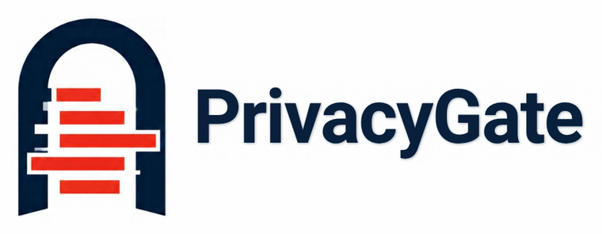

<p align="center">
  
</p>

# PrivacyGate

Redact sensitive values from text before you paste it into an AI service.

PrivacyGate replaces emails, phone numbers (including Nigerian formats), card numbers, BVN and NIN, bank account numbers, API keys, passwords, JWTs and private keys with stable placeholders such as `[EMAIL_001]`. It runs on your machine, uses only the Python standard library, and never makes a network request.

```text
$ privacygate redact notes.txt -r notes.clean.txt -t "Project Falcon"
```

```text
before: Ring 0803 123 4567 or ada@example.com about Project Falcon.
after:  Ring [PHONE_001] or [EMAIL_001] about [CONFIDENTIAL_001].
```

## Install

Requires Python 3.10 or newer.

```bash
pip install git+https://github.com/seun-john/privacygate.git
```

## Use

| Command | What it does |
| --- | --- |
| `privacygate redact FILE -r OUT [-t TERM ...] [--terms-file F] [--mapping-out M]` | Redact a UTF-8 text file and write the cleaned copy to `OUT`. |
| `privacygate restore FILE -m MAP -r OUT` | Put the originals back using a mapping saved by `--mapping-out`. |
| `privacygate scan input.json` | Redact the `text` field of a JSON file (`{"text": "...", "confidential_terms": [...]}`) and print the report. |

Every command also takes `-o report.json`, `--html report.html` and `--strict`. With `--strict`, the exit code is 1 when anything was redacted, which suits a CI step that blocks text containing secrets. Exit codes: 0 completed, 1 strict findings, 2 unusable input.

The same value always gets the same placeholder within one run, so a model can still tell that two mentions are the same person or number. The report counts what was redacted by kind and never repeats the original values.

## What it detects

| Kind | Rule |
| --- | --- |
| `EMAIL` | Standard address syntax. |
| `PHONE` | International numbers starting with `+`, and Nigerian mobile numbers (`0803 123 4567`, `08031234567`, `2348031234567`). |
| `NATIONAL_ID` | An 11-digit number next to the label `BVN`, `NIN` or `National ID`. |
| `BANK_ACCOUNT` | A 10-digit number next to the label `account`, `acct` or `a/c`. |
| `CARD` | 13 to 19 digits that pass the Luhn check. Random long numbers are left alone. |
| `PASSWORD` | The value after `password`, `passwd`, `api key`, `secret`, `access token` and similar. |
| `TOKEN`, `JWT`, `PRIVATE_KEY` | Common API key formats, JSON web tokens and PEM private keys. |
| `CONFIDENTIAL` | Any term you pass with `-t` or `--terms-file`, matched case-insensitively. |

## Limits

- **Pattern matching is incomplete.** Names, addresses, organisations and free-text identifiers are only caught when you list them as terms. Read the cleaned text before sharing it.
- An unlabelled 11-digit number is not treated as a BVN, because that would redact order numbers and timestamps. Label it or list it as a term.
- The mapping file written by `--mapping-out` contains the original confidential values in plain text. It is only created when you ask for it. Keep it somewhere safe or delete it. PrivacyGate does not encrypt it.
- Text that already contains a generated placeholder such as `[EMAIL_001]` is refused, because restoring it would be ambiguous.
- Files over 10 MiB are refused.

## Develop

```bash
pip install -e ".[dev]"
ruff check . && ruff format --check . && pytest -q
```

MIT licence.
